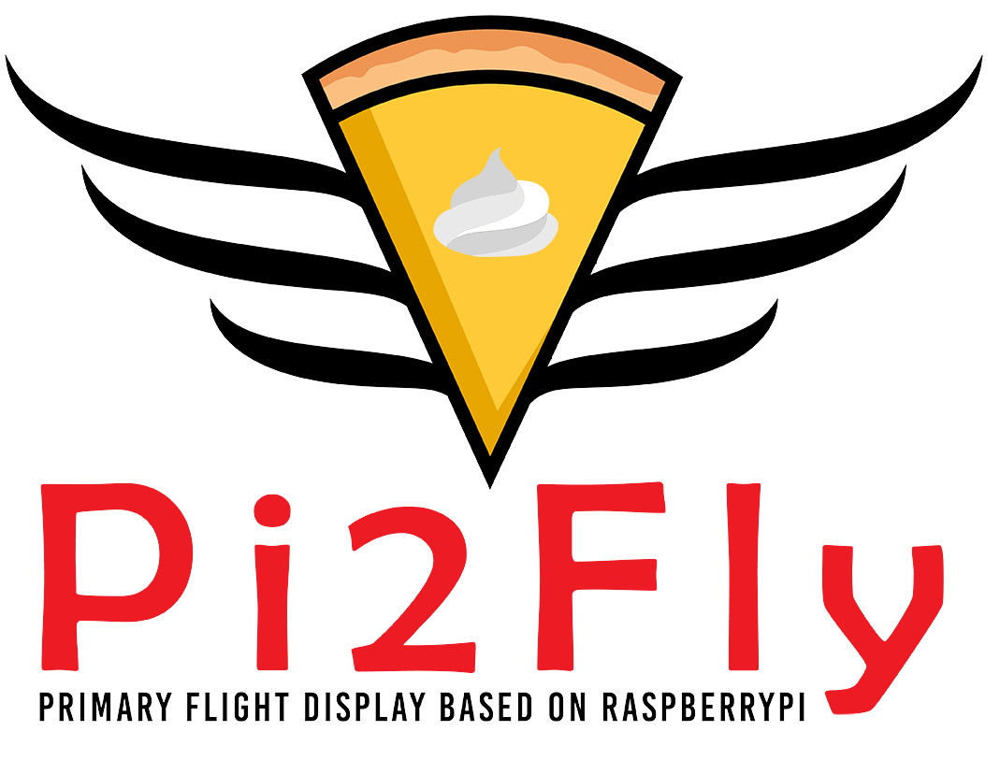
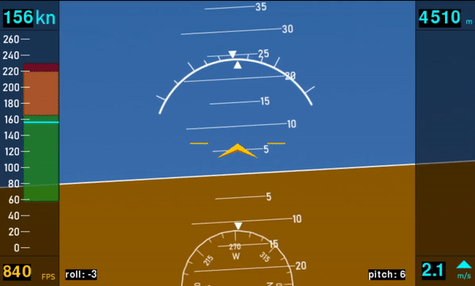
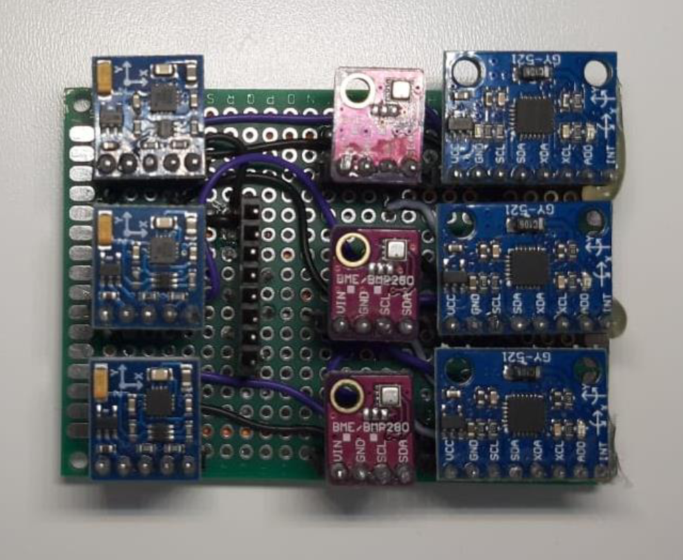
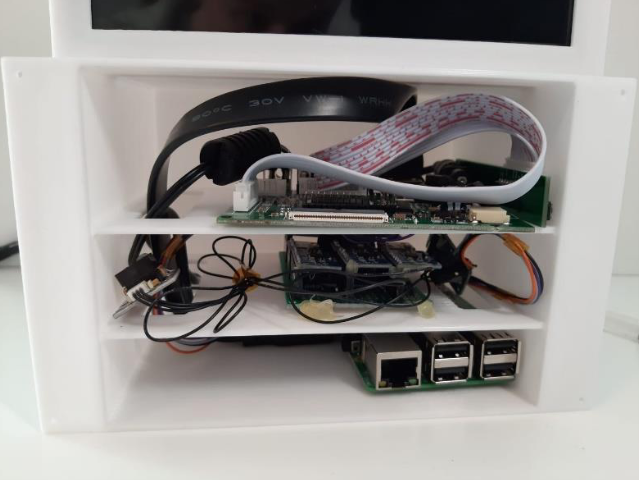
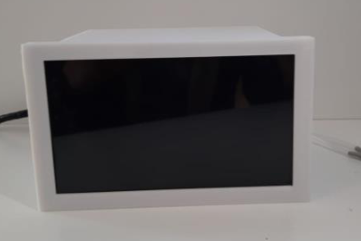

# Pi2Fly (2019)

**Primary Flight Display (PFD) based on Python and OpenGL with the hardware implemented on a Raspberry Pi.**

## Overview
Pi2Fly is a project aimed at demonstrating the feasibility of using off-the-shelf, low-cost components to achieve usable sensor accuracy and reliability. This is accomplished by using multiple sensors of the same kind to provide redundancy and enable the averaging of sensor readings.

This project was completed as a 3 ECTS university assignment during the Bachelor's program.

## Sensors
The following sensors are used and implemented in the project:

- **MPXV7002DP:** Measures airspeed via differential air pressure.
- **3x BME280:** Measures altitude via pressure.
- **3x MPU6959:** Provides an artificial horizon and attitude display via an accelerometer and gyroscope.
- **3x QMC5883L:** Functions as a compass.

## Hardware
- **Raspberry Pi 3b:** The code is implemented on this device.
- **Display:** A generic 7-inch LCD is used for the display.

## Images

